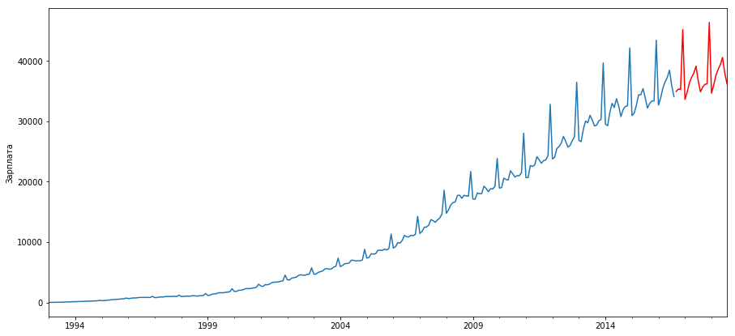

# Time-series-analysis

Анализируются данные о заработной плате в России за каждый месяц с января 1993 по август 2016,
подбираются оптимальные параметры для модели ARIMA и строится прогноз на 2 года вперед от конца данных.